# PB Analyzer 프로젝트 종합 분석 보고서

- 작성일: 2026-02-14
- 문서 버전: v1.0
- 대상: 개발자 / 설계자 / 기획자

---

## 1. 프로젝트 개요

### 1.1 배경 및 문제 정의

레거시 PowerBuilder 시스템의 구조, 화면 흐름, 이벤트/함수 의존성, SQL 영향 범위가 **문서화되어 있지 않아** 변경 영향 분석이 사람 경험에 의존하고 있다. 이로 인해 유지보수 품질과 속도에 리스크가 존재한다.

### 1.2 제품 목표

| 구분 | 내용 |
|------|------|
| **제품명** | PowerBuilder AS-IS 분석기 (`PB Analyzer`) |
| **핵심 목표** | PowerBuilder 소스를 자동 분석하여 화면/이벤트/함수/SQL/테이블 영향도를 구조화 |
| **제공 가치** | 변경 영향 범위를 5분 이내에 확인 가능한 리포트 제공 |
| **기술 방식** | CLI 기반 반복 실행 가능한 추출-분석 파이프라인 |
| **대상 시스템** | 레거시 UI(PowerBuilder) + 백엔드 연계(COBOL 포함) 환경 |

### 1.3 비목표 (Out of Scope)

- COBOL 내부 로직의 정밀 역공학
- 런타임 동적 로직 100% 복원
- 코드 자동 변환(마이그레이션 자동 코드 생성)
- 실시간 IDE 플러그인, 런타임 트레이싱 에이전트

### 1.4 대상 사용자

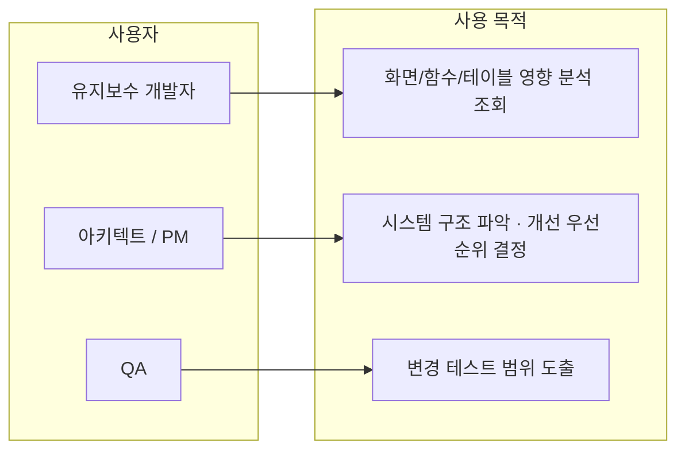

---

## 2. 시스템 아키텍처

### 2.1 상위 아키텍처 개념도

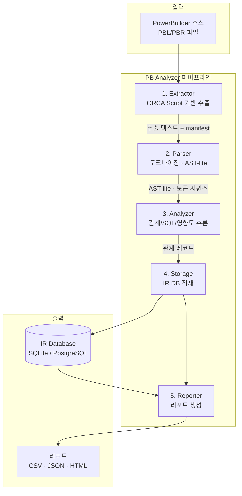

### 2.2 모듈 구조

```
src/pb_analyzer/
├── cli/            CLI 진입점 (extract, analyze, report, run-all)
├── pipeline/       단계 오케스트레이션
├── extractor/      ORCA toolchain 격리 (Protocol 기반 어댑터 패턴)
├── parser/         PowerScript 토크나이징 · fail-soft 파싱
├── analyzer/       관계 추론 (calls, opens, uses_dw, reads, writes, triggers_event)
├── storage/        SQLite/PostgreSQL IR 적재, run_id 기반 버전 관리
├── reporter/       CSV/JSON/HTML 리포트 생성
├── rules/          분석 규칙 관리 (semver 버전관리)
├── observability/  로깅 · 메트릭
└── common/         공통 타입 · 유틸리티
```

### 2.3 핵심 설계 결정

| 결정 사항 | 설계 방향 | 이유 |
|-----------|-----------|------|
| ORCA 격리 | `ExtractorAdapter` Protocol로 벤더 의존 분리 | 벤더 도구 변경 시 파이프라인 본체 영향 차단 |
| Fail-soft 파싱 | 구문 오류 발생 시 해당 객체 skip 후 계속 진행 | 부분 실패가 전체 파이프라인을 중단시키지 않도록 |
| run_id 버전 관리 | 모든 결과를 실행 단위(run_id)로 격리 저장 | 실행 간 비교/회귀 분석 가능 |
| 규칙 거버넌스 | semver 버전, owner, regression 결과 필수 기입 | 규칙 변경의 추적성과 품질 보증 |

---

## 3. 처리 프로세스 상세

### 3.1 전체 파이프라인 흐름

```mermaid
flowchart TD
    START([시작: pb-analyzer run-all]) --> INIT[실행 초기화<br/>run_id 생성 · 로깅 설정]

    INIT --> EXT_START[/1단계: Extract/]
    EXT_START --> EXT_ORCA[ORCA Script 실행<br/>PBL → 텍스트 추출]
    EXT_ORCA --> EXT_MANIFEST[추출 manifest 생성<br/>객체 목록 · 실패 목록]
    EXT_MANIFEST --> EXT_CHECK{추출<br/>성공?}
    EXT_CHECK -->|실패 객체 존재| EXT_LOG[실패 객체 로깅<br/>skip 후 계속]
    EXT_CHECK -->|전체 성공| PAR_START
    EXT_LOG --> PAR_START

    PAR_START[/2단계: Parse/]
    PAR_START --> PAR_TOKEN[토크나이징<br/>PowerScript 구문 분석]
    PAR_TOKEN --> PAR_ENTITY[엔티티 식별<br/>Window · Event · Function<br/>UserObject · Menu · DataWindow]
    PAR_ENTITY --> PAR_CHECK{파싱<br/>오류?}
    PAR_CHECK -->|오류 발생| PAR_SOFT[fail-soft 처리<br/>오류 위치 로깅 · skip]
    PAR_CHECK -->|정상| ANA_START
    PAR_SOFT --> PAR_LIMIT{파일당 에러<br/>100건 초과?}
    PAR_LIMIT -->|예| PAR_SKIP[해당 파일 중단]
    PAR_LIMIT -->|아니오| PAR_ENTITY
    PAR_SKIP --> ANA_START

    ANA_START[/3단계: Analyze/]
    ANA_START --> ANA_REL[관계 추론<br/>calls · opens · triggers_event]
    ANA_REL --> ANA_DW[DataWindow SQL 추출<br/>uses_dw 관계 매핑]
    ANA_DW --> ANA_SQL[Embedded SQL 추출<br/>정규화 · CRUD 분류]
    ANA_SQL --> ANA_TBL[테이블 영향도 분석<br/>reads · writes 관계 매핑]
    ANA_TBL --> ANA_CONF[신뢰도 산출<br/>confidence 0.0~1.0]

    ANA_CONF --> STO_START[/4단계: Persist/]
    STO_START --> STO_WRITE[IR DB 적재<br/>run_id 기반 격리 저장]
    STO_WRITE --> STO_IDX[인덱스 적용<br/>조회 성능 최적화]

    STO_IDX --> REP_START[/5단계: Report/]
    REP_START --> REP_GEN[리포트 생성<br/>CSV · JSON · HTML]
    REP_GEN --> REP_SUMMARY[실행 요약 리포트<br/>처리 건수 · 오류율 · 소요 시간]
    REP_SUMMARY --> FINISH([완료: 종료코드 반환])
```

### 3.2 CLI 명령 체계

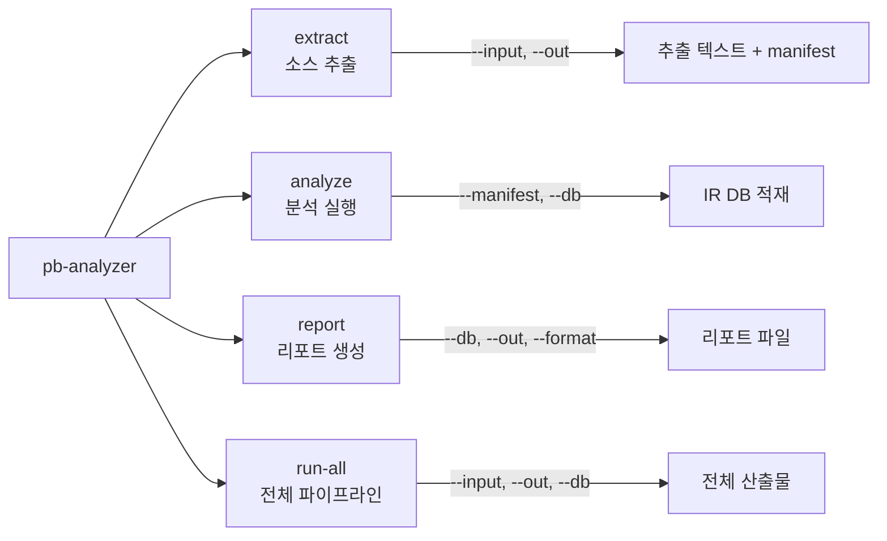

### 3.3 종료 코드 체계

| 코드 | 의미 | 대응 |
|------|------|------|
| `0` | 성공 | 정상 완료 |
| `1` | 사용자 입력/환경 오류 | 입력 경로, 권한, DB 연결 확인 |
| `2` | 분석 단계 오류 (부분 실패 포함) | 실패 객체 목록 확인 후 재시도 |

---

## 4. 데이터 모델 (IR Schema)

### 4.1 ER 다이어그램

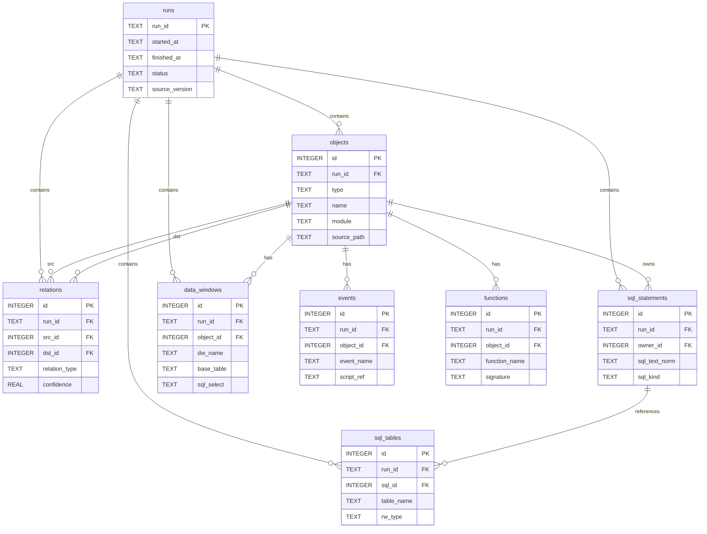

### 4.2 관계 유형 (relation_type)

| 관계 | 설명 | 예시 |
|------|------|------|
| `calls` | 함수/이벤트 호출 | `w_main.clicked` → `f_validate()` |
| `opens` | 화면 전환/열기 | `w_main` → `w_detail` |
| `uses_dw` | DataWindow 사용 | `w_order` → `dw_order_list` |
| `reads` | 테이블 읽기 (SELECT) | `f_search()` → `TB_ORDER` |
| `writes` | 테이블 쓰기 (INSERT/UPDATE/DELETE) | `f_save()` → `TB_ORDER` |
| `triggers_event` | 이벤트 트리거 | `btn_save.clicked` → `ue_save` |

### 4.3 SQL 분류 (sql_kind)

`SELECT` · `INSERT` · `UPDATE` · `DELETE` · `MERGE` · `OTHER`

---

## 5. 핵심 사용 시나리오

### 5.1 변경 영향 분석 흐름

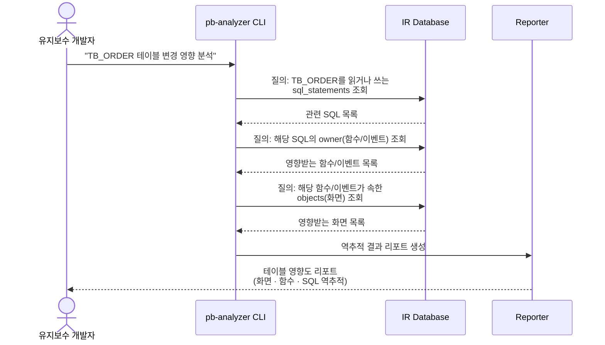

### 5.2 필수 리포트 5종

| # | 리포트 | 설명 | 주 사용자 |
|---|--------|------|-----------|
| 1 | 화면 인벤토리 | 전체 Window/UserObject/Menu 목록 | 아키텍트, PM |
| 2 | 이벤트-함수 맵 | 이벤트 → 함수 호출 관계 매핑 | 개발자 |
| 3 | 테이블 영향도 | 테이블 → 화면/함수 역추적 | 개발자, QA |
| 4 | 화면 이동/호출 그래프 | 화면 간 전환(opens) 시각화 | 아키텍트 |
| 5 | 미사용 객체 후보 | 호출/참조가 없는 객체 식별 | 아키텍트, PM |

---

## 6. 기술 스택

### 6.1 구성 요소

| 영역 | 기술 | 비고 |
|------|------|------|
| 언어 | Python 3.11 (pinned) | 재현 가능한 빌드 |
| 저장소 | SQLite (기본) / PostgreSQL (선택) | 오픈소스, 벤더 락인 없음 |
| 빌드 | setuptools + wheel | `pyproject.toml` 기반 |
| 테스트 | pytest 8.3.5, pytest-cov 6.0.0 | 커버리지 80% 이상 |
| 린트 | ruff 0.9.7 | line-length=100 |
| 타입 체크 | mypy 1.15.0 | strict mode |
| CI/CD | GitHub Actions | PR/push to main 자동 검증 |
| 설정 | YAML | 로깅/파서/분석 규칙 설정 |

### 6.2 벤더 의존성 평가

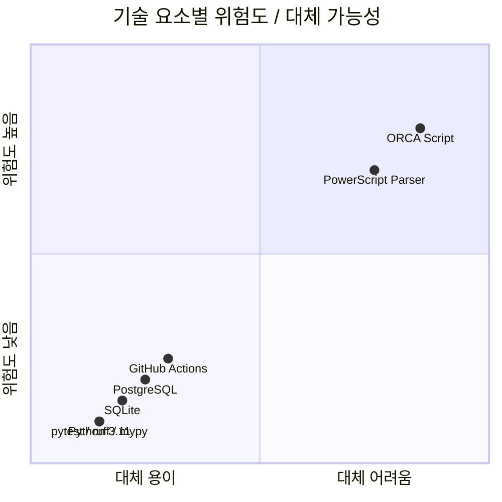

> **핵심 리스크**: ORCA Script(벤더 의존)과 커스텀 PowerScript 파서(도메인 난이도)가 유지보수 위험도가 가장 높다. 어댑터 패턴과 fail-soft 전략으로 통제한다.

---

## 7. 품질 보증 체계

### 7.1 테스트 전략

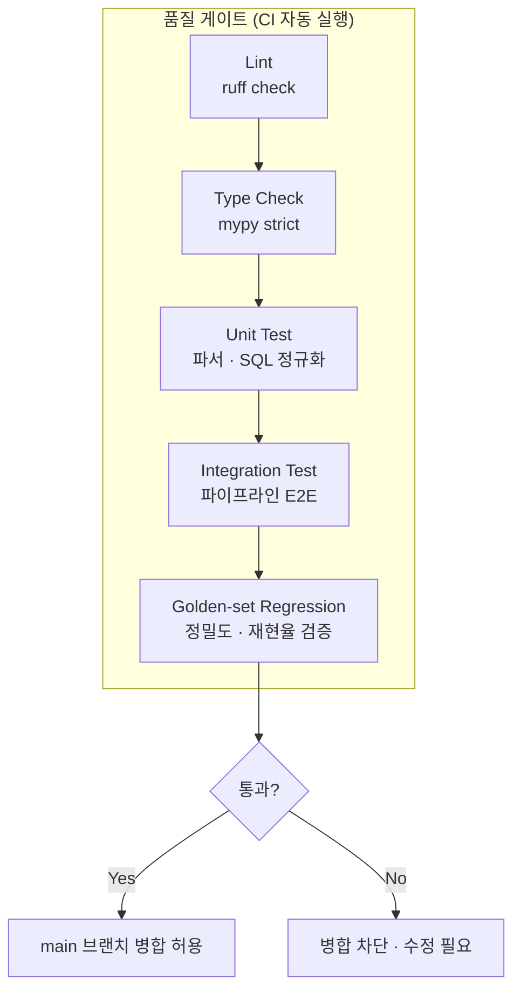

### 7.2 KPI 기준

| 지표 | 목표 | 측정 방법 |
|------|------|-----------|
| 화면 추출 성공률 | 80% 이상 | 전체 화면 중 정상 추출 비율 |
| 골든셋 정밀도 (Precision) | 85% 이상 | 20개 화면 기준, 올바른 관계 / 추출된 관계 |
| 골든셋 재현율 (Recall) | 75% 이상 | 20개 화면 기준, 추출된 관계 / 실제 관계 |
| 영향 분석 소요 시간 | 5분 이내 | 특정 화면 변경 영향 분석 시간 |
| 전체 파이프라인 실행 | 30분 이내 | 기준 데이터셋 전체 분석 |
| 결과 재현율 | 100% | 동일 입력 반복 실행 시 동일 결과 |

### 7.3 규칙 거버넌스 프로세스

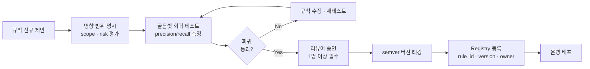

---

## 8. 프로젝트 일정 및 마일스톤

### 8.1 스프린트 로드맵

```mermaid
gantt
    title PB Analyzer MVP 개발 로드맵
    dateFormat YYYY-MM-DD
    axisFormat %m/%d

    section S1 착수/추출
    이해관계자 인터뷰·범위 확정     :s1a, 2026-02-16, 5d
    ORCA 추출 설계·manifest 규격    :s1b, 2026-02-23, 5d
    M1: 추출 규격·IR 스키마 확정     :milestone, m1, 2026-02-27, 0d

    section S2 파싱/관계
    추출 오류 처리 구현              :s2a, 2026-03-02, 3d
    토크나이저·파서 MVP              :s2b, 2026-03-05, 5d
    호출·화면이동 관계 추출          :s2c, 2026-03-10, 4d
    M2: 호출·화면이동 추출 MVP       :milestone, m2, 2026-03-13, 0d

    section S3 SQL/리포트
    DataWindow SQL 추출              :s3a, 2026-03-16, 4d
    Embedded SQL·IR 적재             :s3b, 2026-03-20, 4d
    핵심 리포트 3종                  :s3c, 2026-03-24, 4d
    M3: 핵심 리포트 배포 가능        :milestone, m3, 2026-03-27, 0d

    section S4 정확도
    화면이동 그래프·미사용 객체      :s4a, 2026-03-30, 4d
    골든셋 라벨링·정확도 측정        :s4b, 2026-04-03, 4d
    오탐·미탐 보정                   :s4c, 2026-04-07, 4d
    M4: 정확도 보정 완료             :milestone, m4, 2026-04-10, 0d

    section S5 운영화
    회귀 자동화·성능 튜닝            :s5a, 2026-04-13, 5d
    배치 CI·Runbook·인수인계         :s5b, 2026-04-18, 5d
    M5: 운영 배치 전환 완료          :milestone, m5, 2026-04-24, 0d
```

### 8.2 작업 패키지 공수

| ID | 작업 패키지 | 산출물 | 예상 공수 |
|---|---|---|---|
| WP-01 | 요구사항/범위 확정 | 범위정의서, 승인 기록 | 5MD |
| WP-02 | 추출 파이프라인 | 추출 스크립트, manifest | 8MD |
| WP-03 | 파서/분석 코어 | 파싱 모듈, 관계 추출기 | 15MD |
| WP-04 | SQL 분석 | SQL 추출/정규화 모듈 | 8MD |
| WP-05 | IR 저장소 | DB 스키마, 적재 모듈 | 5MD |
| WP-06 | 리포트 모듈 | 5종 리포트 | 10MD |
| WP-07 | 정확도/회귀 | 골든셋, 자동 비교 스크립트 | 8MD |
| WP-08 | 성능/운영화 | 튜닝 결과, Runbook, CI | 6MD |
| | **합계** | | **65MD** |

리스크 버퍼: 기술 난이도 15% + 데이터 품질 10% + 운영 전환 10%

---

## 9. 운영 프로세스

### 9.1 배치 실행 흐름

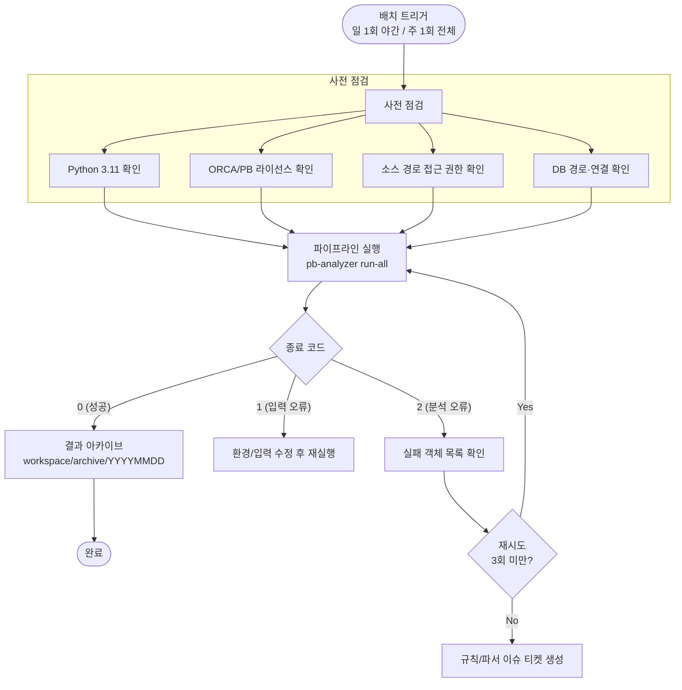

### 9.2 장애 대응 분류

| 장애 유형 | 원인 | 대응 |
|-----------|------|------|
| 환경 오류 | Python/ORCA 미설치, 라이선스 만료 | 환경 재구성, 라이선스 갱신 |
| 권한 오류 | 소스 경로/DB 접근 불가 | 권한 부여 요청 |
| 추출 실패 | ORCA Script 실행 오류 | 실패 객체 skip, 로그 확인 후 재시도 |
| 파싱 실패 | 난해한 PowerScript 문법 | fail-soft로 skip, 예외 규칙 추가 검토 |
| 정확도 하락 | 규칙 변경 부작용 | 골든셋 회귀 결과 확인, 규칙 롤백 |

---

## 10. 리스크 관리

### 10.1 리스크 매트릭스

| ID | 리스크 | 영향도 | 발생 가능성 | 대응 전략 |
|---|---|---|---|---|
| R-01 | 난해한 PowerScript 문법/동적 호출로 인한 미탐 | 높음 | 높음 | 예외 패턴 카탈로그 운영, fail-soft 파싱 |
| R-02 | SQL 문자열 조립 패턴으로 인한 테이블 식별 누락 | 높음 | 중간 | SQL 정규화 규칙 점진 확장 |
| R-03 | 대형 프로젝트에서 성능 저하 | 중간 | 중간 | 배치 분할, 스트리밍 적재, 프로파일링 |
| R-04 | ORCA/PB 라이선스/환경 변경 | 높음 | 낮음 | 어댑터 패턴으로 벤더 격리 |
| R-05 | 규칙 누적에 따른 유지보수 복잡도 증가 | 중간 | 중간 | 규칙 거버넌스(semver, 회귀 필수) |

### 10.2 기술스택 유지보수성 판정

**조건부 적합 (Go with controls)**

- 무료/표준 기술 비중이 높아 장기 비용 리스크는 낮음
- 단, PowerBuilder/ORCA 의존 및 파서 난이도는 통제 없으면 유지보수 난이도 상승 가능
- 통제 수단: 의존성 고정, 어댑터 격리, 규칙 거버넌스, 골든셋 회귀 자동화

---

## 11. 현재 진행 상태

### 11.1 구현 현황

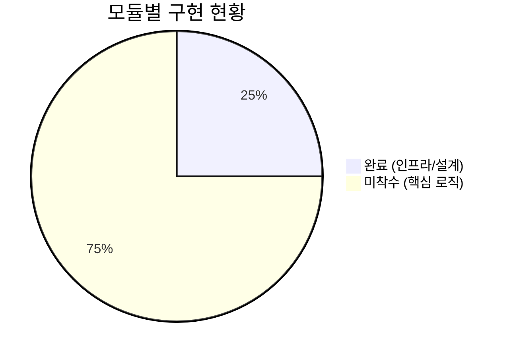

| 구분 | 항목 | 상태 |
|------|------|------|
| **완료** | PRD/TRD/WBS 문서 | 작성 완료 |
| **완료** | 프로젝트 구조 및 스캐폴딩 | 구축 완료 |
| **완료** | pyproject.toml (의존성 고정) | 설정 완료 |
| **완료** | SQL 스키마 + 인덱스 | 설계 완료 (CHECK/FK 제약 포함) |
| **완료** | ExtractorAdapter Protocol | 구현 완료 |
| **완료** | CI/CD 파이프라인 프레임워크 | 구축 완료 |
| **완료** | 설정 파일 (logging, parser, analyzer) | 정의 완료 |
| **완료** | 규칙 거버넌스 체계 | 정의 완료 |
| **미착수** | Parser (토크나이저/AST-lite) | S2 예정 |
| **미착수** | Analyzer (관계/SQL 추론) | S2~S3 예정 |
| **미착수** | Storage (DB 적재) | S3 예정 |
| **미착수** | Reporter (리포트 생성) | S3~S4 예정 |
| **미착수** | CLI 명령 구현 | S2~S3 예정 |
| **미착수** | 골든셋 테스트 데이터 | S4 예정 |

### 11.2 다음 단계 (S1 잔여 → S2 착수)

1. ORCA Script 추출 절차 설계 확정
2. 추출 결과 manifest 규격 확정
3. 토크나이저/파서 MVP 개발 착수
4. 골든셋 화면 선정 및 라벨링 준비
